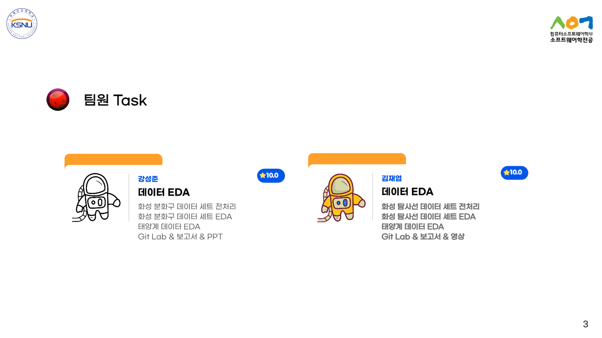
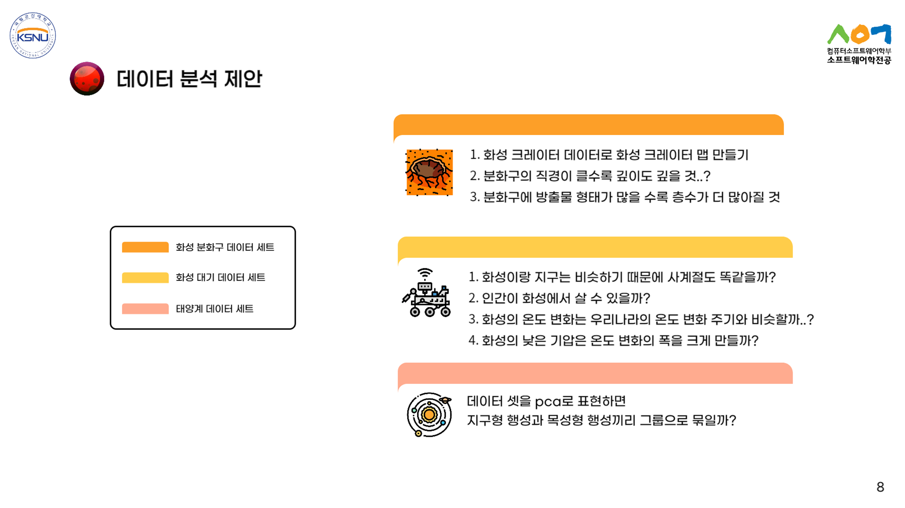
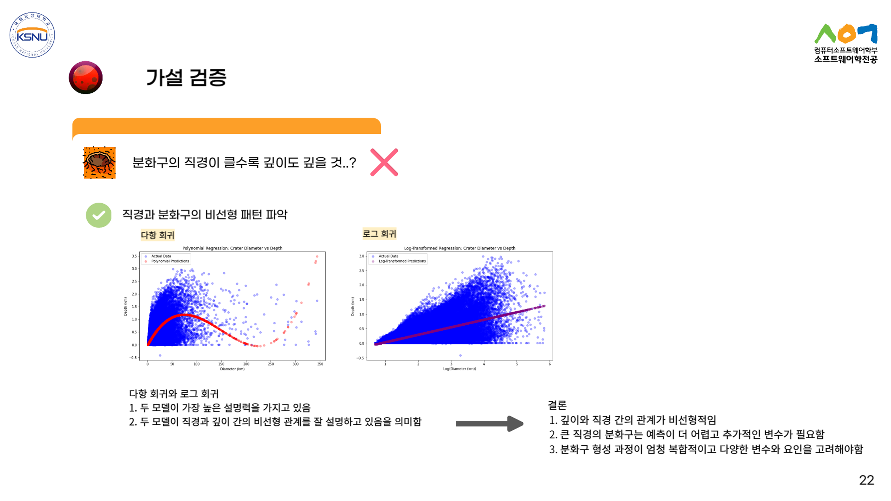
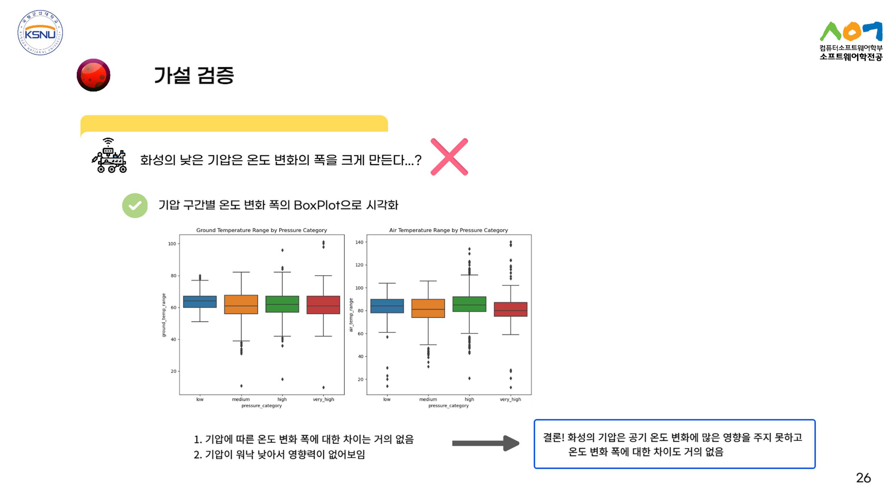
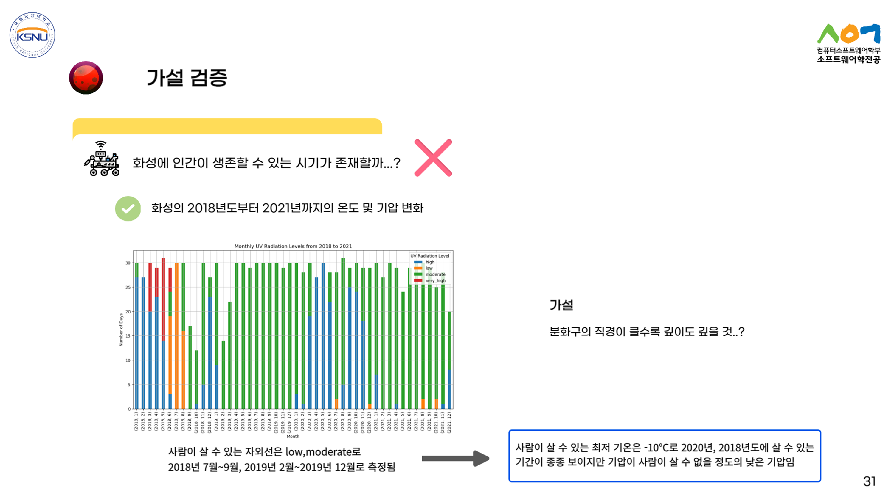
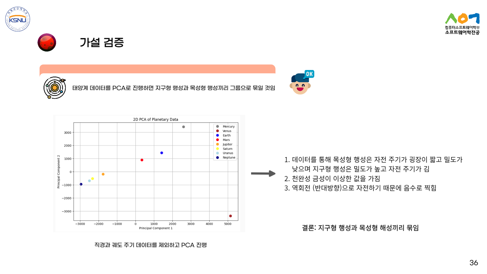
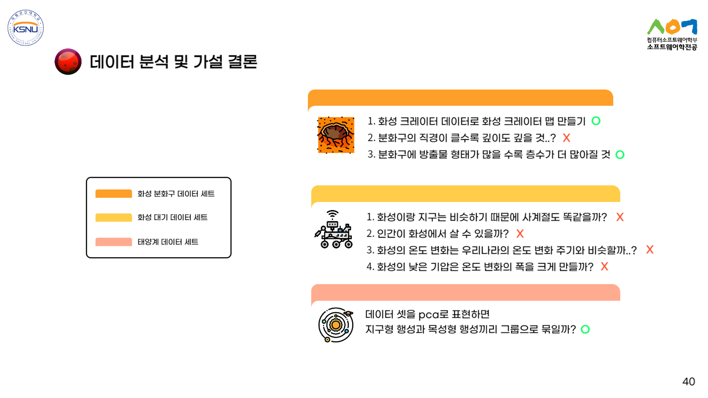

# 🔍 Mars Data EDA
---------------------------------------------------------------------------
## 🔹 Project Overview
This project focuses on analyzing Martian craters, atmosphere, and solar system data to gain insights into planetary characteristics and potential habitability.
---------------------------------------------------------------------------
## 📊 Key Hypotheses & Questions
### 🔴 Martian Crater Analysis
    - Can we create a detailed Martian crater map based on crater datasets? 🗺️
    - Does a larger crater diameter correlate with greater depth? 📏
### 🟡 Martian Atmosphere & Climate
    - Is Mars' seasonal cycle similar to Earth's due to its axial tilt? ❄️☀️
    - How does temperature variation on Mars compare to Earth's seasonal temperature changes? 🌡️
### 🟠 Solar System & PCA Analysis
    - Can we use PCA (Principal Component Analysis) to classify planets into Earth-like vs. gas giants? 🪐📈
---------------------------------------------------------------------------
## ⚙️ Technology Stack
    - Python (Pandas, NumPy, Matplotlib, SciPy) 🐍
    - Machine Learning (PCA, Clustering) 🤖
    - Data Visualization (Seaborn, Plotly) 📊
---------------------------------------------------------------------------
### 🔬 Data Analysis Proposal

